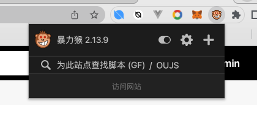
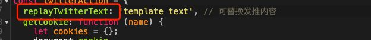

### 跟推工具使用说明

工具包依赖于`暴力猴` Google插件，需要用户下载并安装到Google浏览器

下载地址：https://chrome.google.com/webstore/detail/violentmonkey/jinjaccalgkegednnccohejagnlnfdag/related




点击 插件右上角`+`号后会打开新页面，把文件夹中`replyTwitter.js`文件内容复制粘贴到这个新页面中




可替换后面`twmplate text`为需要回推内容


保存之后，回到推特页面，刷新首页即可


```
注意：

1. twitter 必须登陆
2. 定时器时间为10秒查询一次接口
3. 每次获取数据为8条，并调用推特接口完成replay twitter事件
4. 重复发相同的内容，twitter会自动过滤
```

